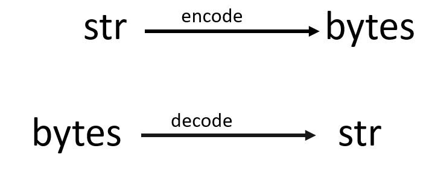
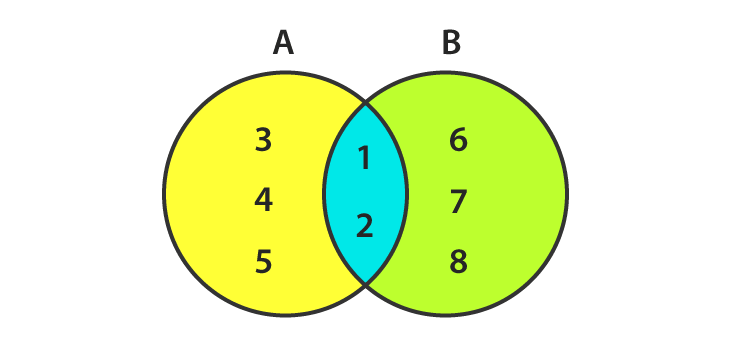
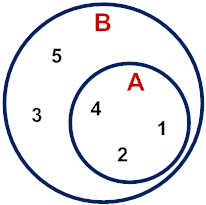

## Collections


### Strings: str
- Str is the short form of string
- Str data type is immutable i.e once you declare it, you cannot able to modify it.

Syntax:
```python
>>>"this is string"
'this is string'
>>>'this is also a string'
'this is also a string'
>>>"This is not way of declering the string'
 File "<stdin>", line 1
    "This is not way of declering the string'
                                            ^
SyntaxError: EOL while scanning string literal
>>>'This is also not way of declering the string"
 File "<stdin>", line 1
    'This is also not way of declering the string"
                                                 ^
SyntaxError: EOL while scanning string literal
```
You can check the data type of the string
```python
>>>a = "paly with python"
>>>type(a)
<class 'str'>
```
String with new lines:

- Multi line strings: spread the literal across multipule lines.
```python
>>>""" This is
... multi line string
... this is end"""
'This is\nmulti line string\nthis is end'
>>> poem = """Just like moons and like suns,
... With the certainity of tides,
... Just like hopes springing high,
... Still I'll raise."""
>>> poem
'Just like moons and like suns,\nWith the certainity of tides,\nJust like hopes springing high,\nStill I'll raise.'
>>> print(poem)
Just like moons and like suns,
With the certainity of tides,
Just like hopes springing high,
Still I'll raise.
```
- Escape sequences : Embed escape sequences in a single-line literal

Python lets you escape the meaning of some characters with in strings to achieve effects that would otherwise be difficult to express.By preceding a character with a backslash (\),
you give it a special meaning.The most common escape sequence is \n,which means to begin a new line.
```python
>>> 'This is\nmulti line string\nthis is end'
'This is\nmulti line string\nthis is end'
>>> a = 'You are not your parents\nYou are not your class\nYou are not the clothes you wear\nYou are not the size of your friend circle\nYour sum of your words. choices and actions.'
>>> a
'You are not your parents\nYou are not your class\nYou are not the clothes you wear\nYou are not the size of your friend circle\nYour sum of your words. choices and actions.'
>>> print(a)
You are not your parents
You are not your class
You are not the clothes you wear
You are not the size of your friend circle
Your sum of your words. choices and actions.
```
More escape sequences:
```python
>>> palindrome = 'A man,\nA plan,\nA canal:\nPanama.'
>>> print(palindrome)
A man,
A plan,
A canal:
Panama.
>>> print('\tabc')
    abc
>>> print('a\tbc')
a   bc
>>> print('ab\tc')
ab    c
>>> testimony = "\"I did nothing!\" he said. \"Or that other thing.\""
>>> print(testimony)
"I did nothing!" he said. "Or that other thing."
>>> fact = "The world's largest rubber duck was 54'2\" by 65'7\" by 105'"
>>> print(fact)
The world's largest rubber duck was 54'2" by 65'7" by 105'
>>> speech = 'The backslash (\\) can be printed using like this.'
>>> print(speech)
The backslash (\) can be printed using like this.
```
Combining by using +

 we can combine literal strings or string variables using the + operator.

```python
>>> "good "+"morning"
'good morning'
>>> name = "Joe"
>>> branch = " computer science and engineering"
>>> print(name+branch)
Joe computer science and engineering
>>> a = 'Duck.'
>>> b = a
>>> c = 'Grey Duck!'
>>> a+b+c
'Duck.Duck.Grey Duck!'
```
Duplicate with *

We use the * operator to duplicate a string.

```python
>>> "hi"*3
'hihihi'
>>> "hello "*3
'hello hello hello'
>>> a = 'Na ' * 4 + '\n'
>>> b = 'Hey ' * 3 + '\n'
>>> end = 'Goodbye.'
>>> print(start + start + middle + end)
Na Na Na Na
Na Na Na Na
Hey Hey Hey
Goodbye.
```
Notice that the * has higher precedence than +, so the string is duplicated before the line feed is tacked on.

Get characters with []

- To get a single character from a string, specify its offset inside square brackets after the string’s name.
- The first (leftmost) offset is 0, the next is 1, and so on.

```python
>>> letters = 'abcdefghijklmnopqrstuvwxyz'
>>> letters[0]
a
>>> letters[25]
z
```

Get a substring with a slice

syntax:
```python
[start_offset:end_offset:step(optional)]
```
```python
>>> letters[1:11]
'bcdefghijk'
>>> letters[1:20:2]
'bdfhjlnprt'
>>> letters[::5]
'afkpuz'
>>> letters[21]
'v'
```
Get Length with len()

The len() function counts characters in a string:

Syntax:

```python
len(string)
```

```python
>>> letters = 'abcdefghijklmnopqrstuvwxyz'
>>> len(letters)
26
>>> empty = ""
>>> len(empty)
0
```
spilt with split()

You can use the built-in string split() function to break a string into a list of smaller strings based on some separator.

syntax:
```python
string.split('seperator')
```
```python
>>> tasks = 'get gloves,get mask,give cat vitamins,call ambulance'
>>> tasks.split(',')
['get gloves', 'get mask', 'give cat vitamins', 'call ambulance']
>>> tasks.split()
['get', 'gloves,get', 'mask,give', 'cat', 'vitamins,call', 'ambulance']
```
combine by using join()

syntax:
```python
seperator.join(list)
```

```python
>>> crypto_list = ['Yeti', 'Bigfoot', 'Loch Ness Monster']
>>> crypto_string = ', '.join(crypto_list)
>>> print(crypto_string)
Yeti, Bigfoot, Loch Ness Monster
```
Substitute by Using replace()

You use replace() for simple substring substitution.Give it the old substring, the new one,and how many instances of the old substring to replace.
It returns the changed string but does notmodify the original string.If you omit this final count argument, it replaces all instances.

Syntax:
```python
string.replace(old_substring, new_substring, count(optional))
```
```python
>>> setup = "a duck goes into a bar..."
>>> setup.replace('duck', 'marmoset')
>>> setup.replace('duck', 'marmoset')
'a marmoset goes into a bar...'
>>> setup
'a duck goes into a bar...'
```

Strip with strip()
The strip() functions shown here assume that you want to get rid ofwhitespace characters (' ', '\t', '\n')if you don’t give them an argument.strip() str.
strip() strips both ends, lstrip() only from the left, and rstrip() only from the right.

Syntax :
```python
string.strip()
```
```python
>>> world = "    earth   "
>>> world.strip()
'earth'
>>> world.strip(' ')
'earth'
>>> world.lstrip()
'earth  '
>>> world.rstrip()
'   earth'
```
If the character were not there, nothing happens:

```python
>>> world.strip('!')
'   earth   '
```

Besides no argument (meaning whitespace characters) or a single character, you can also tell strip() to remove any character in a multicharacter string:

```python
>>> blurt = "What the...!!?"
>>> blurt.strip('.?!')
'What the'
```
Search and Select

```python
>>> poem = '''All that doth flow we cannot liquid name
... Or else would fire and water be the same;
... But that is liquid which is moist and wet
... Fire that property can never get
.... Then 'tis not cold that doth the fire put out
... But 'tis the wet that makes it die, no doubt.'''
>>> poem[:13]
'All that doth'
>>> len(poem)
254
>>> poem.startswith('All')
True
>>> poem.endswith('That\'s all, folks!')
False
```
Let’s find the offset of the first occurrenceof the word the in the poem:
```python
>>> word='the'
>>> poem.find(word)
73
>>> poem.index(word)
73
```
And the offset of the last the:

```python
>>> word = 'the'
>>> poem.rfind(word)
218
>>> poem.rindex(word)
218
```

How many times does the three-letter sequence 'the' occur?

```python
>>> poem.count(word)
3
```
Are all of the characters in the poem either letters or numbers?

```python
>>> poem.isalnum()
False
```

Cases:

```python
>>> setup = 'a duck goes into a bar...'
```

```python
>>> setup.strip('.')
'a duck goes into a bar'
```
Capitalize the first word:

```python
>>> setup.capitalize()
'A duck goes into a bar...'
```

Capitalize all the words:

```python
>>> setup.title()
'A Duck Goes Into A Bar...'
```

Convert all characters to uppercase:

```python
>>> setup.upper()
'A DUCK GOES INTO A BAR...'
```

Convert all characters to lowercase:

```python
>>> setup.lower()
'a duck goes into a bar...'
```

Swap uppercase and lowercase:

```python
>>> setup.swapcase()
'A DUCK GOES INTO A BAR...'
>>> setup
'a duck goes into a bar...'
```

Formatting :

<table border="1" align='left'>
<tr><td>%s</td><td>string</td></tr>
<tr><td>%d</td><td>decimal integer</td></tr>
<tr><td>%x</td><td>hex integer</td></tr>
<tr><td>%o</td><td>octal integer</td></tr>
<tr><td>%f</td><td>decimal float</td></tr>
<tr><td>%e</td><td>exponential float</td></tr>
<tr><td>%g</td><td>decimal or exponential float</td></tr>
</table>
<br><br>

You can use a %s for any data type, and Python will format it as a string with no extra spaces.

```python
>>> '%s' % 42
'42'
>>> '%d' % 42
'42'
>>> '%x' % 42
'2a'
>>> '%o' % 42
'52'
```

An integer and a literal %:

```python
>>> '%d%%' % 100
'100%'
```

Let's try some string and integer interpolation:

```python
>>> actor = 'Richard Gere'
>>> cat = 'Chester'
>>> weight = 28
>>> "My friend's favorite actor is %s" % actor
"My friend's favorite actor is Richard Gere"
>>> "Our cat %s weighs %d pounds" % (cat, weight)
'Our cat Chester weighs 28 pounds'
```
some more examples

```python
>>> thing = 'woodchuck'
>>> '%s' % thing
'woodchuck'
>>> '%12s' % thing
'   woodchuck'
>>> '%+12s' % thing
'   woodchuck'
>>> '%-12s' % thing
'woodchuck   '
>>> '%.3s' % thing
'woo'
>>> '%12.3s' % thing
'         woo'
>>> '%-12.3s' % thing
'woo         '
```

one more with feeling

```python
>>> thing = 98.6
>>> '%f' % thing
'98.600000'
>>> '%12f' % thing
'   98.600000'
>>> '%6f' % thing
'98.600000'
>>> '%+12f' % thing
'  +98.600000'
>>> '%-12f' % thing
'98.600000   '
>>> '%.3f' % thing
'98.600'
>>> '%12.3f' % thing
'      98.600'
>>> '%-12.3f' % thing
'98.600      '
```
New style:{} and format()

“New style” formatting has the form format_string.format(data).

```python
>>> thing = 'woodchuck'
>>> '{}'.format(thing)
'woodchuck'
```
The arguments to the format() function need to be in the order as the {} placeholders in the format string:
```python
>>> thing = 'woodchuck'
>>> place = 'lake'
>>> 'The {} is in the {}.'.format(thing, place)
'The woodchuck is in the lake.'
```

With new-style formatting, you can also specify the arguments by position like this:

```python
>>> 'The {1} is in the {0}.'.format(place, thing)
'The woodchuck is in the lake.'
```

The value 0 referred to the first argument, place, and 1 referred to thing.

The arguments to format() can also be named arguments

```python
>>> 'The {thing} is in the {place}'.format(thing='duck', place='bathtub')
'The duck is in the bathtub'
```
or a dictionary:
```python
>>> d = {'thing': 'duck', 'place': 'bathtub'}
>>> 'The {0[thing]} is in the {0[place]}.'.format(d)
'The duck is in the bathtub.'
```

More Examples:
```python
>>> thing = 'wraith'
>>> place = 'window'
>>> 'The {} is at the {}'.format(thing, place)
'The wraith is at the window'
>>> 'The {:10s} is at the {:10s}'.format(thing.upper(), place)
'The WRAITH     is at the window    '
>>> 'The {:<10s} is at the {:<10s}'.format(thing, place)
'The wraith     is at the window    '
>>> 'The {:^10s} is at the {:^10s}'.format(thing, place)
'The   wraith   is at the   window  '
>>> 'The {:>10s} is at the {:>10s}'.format(thing, place)
'The     wraith is at the     window'
>>> 'The {:!^10s} is at the {:!^10s}'.format(thing, place)
'The !!wraith!! is at the !!window!!'
```
Newest Style: f-strings

- f-strings appeared in Python 3.6, and are now the recommended way of formatting strings.
To make an f-string:
- Type the letter f or F directly before the initial quote.
- Include variable names or expressions within curly brackets ({}) to get their values into the string.

```python
>>> thing = 'wereduck'
>>> place = 'werepond'
>>> f'The {thing} is in the {place}'
'The wereduck is in the werepond'
>>> f'The {thing.capitalize()} is in the {place.rjust(20)}'
'The Wereduck is in the             werepond'
>>> f'The {thing:>20} is in the {place:.^20}'
'The             wereduck is in the ......werepond......'
```
- Starting in Python 3.8, f-strings gain a new shortcut that’s helpful when you want to print variable names as well as their values.

```python
>>> f'{thing =}, {place =}'
"thing ='wereduck', place ='werepond'"
>>> f'{thing[-4:] =}, {place.title() =}'
"thing[-4:] ='duck', place.title() ='Werepond'"
>>> f'{thing = :>4.4}'
'thing = were'
```
- for more details: [python documentation](https://docs.python.org/3/library/stdtypes.html#string-methods)
- These examples are borrowed from the "Introducing Python" 2nd Edition by Bill Lubanovic, O'Reilly media inc.,2019
- Think Python, Second Edition, Allen B. Downey, 2016, O'Reilly
<br>
<br>
<a href='#index'>Go to top</a>
<a href='https://forms.office.com/Pages/ResponsePage.aspx?id=rN2QXMZBb0WKxovA-s_hhWC5rBHwriVMuV_rHfPTy8ZUNEpTV0lDT0lZUjFDSVBZNDFRUllQRFVZMC4u' class='center'>Learning check</a><a href="./" class='right'>Home</a>
<hr>
### Bytes

- Data type for sequence of bytes
- Raw binary data
- Fixed width single byte encoding

```python
>>> b'byte data'
b'byte data'
>>> d= b'some bytes'
>>> type(d)
<class 'bytes'>
>>> d.split()
[b'some', b'bytes']
```
Converting between strings and bytes:


```python
>>> a = b'byte data'
>>> a.decode()
'byte data'
>>> b = 'hello python'
>>> b.encode()
b'hello python'
```
<a href='#index'>Go to Top</a>    <a href="./" class='right'>Home</a>
<hr>

### Lists
- sequence of objects
-  Lists are Mutable
- Lists are declared with [] or list()
- Items are seperated with comma(,)

Create empty list

```python
>>> myfirst_list = []   # one way of creating empty list
>>> type(myfirst_list)
<class 'list'>
>>> mysecond_list = list() # another way of creating empty list
>>> type(mysecond_list)
<class 'list'>
```
python list() converts string into list

```python
>>> list('python')
['p', 'y', 't', 'h', 'o', 'n']
```

Create a list from string split()

```python
>>> python_day='12/12/2019'
>>> python_day.split('/')
['12', '12', '2019']
```
list.reverse() : To reverse the elements in the list

```python
>>> lang=['c','c++','java','python']
>>> lang.reverse()
>>> lang
['python', 'java', 'c++', 'c']
```

Add an Item to the End with append()

```python
>>> lang=['c','c++','java','python']
>>> lang.append('R')
>>> lang
['c', 'c++', 'java', 'python', 'R']
```

Add an Item by Offset with insert()

syntax:

```python
insert(index, word)
```
Examples:

```python
>>> lang=['c', 'c++', 'java', 'python', 'R']
>>> lang.insert(2,'scala')
>>> lang
['c', 'c++', 'scala', 'java', 'python', 'R']
```

Duplicate All Items with *

syntax:

```python
['string']*value
```

Examples:

```python
>>> ['python']*3
['python', 'python', 'python']
>>> ['python','java']*3
['python', 'java', 'python', 'java', 'python', 'java']
```
Combine Lists by Using extend() or +

```python
>>> lang
['c', 'c++', 'scala', 'java', 'python', 'R']
>>> markups=['html','xml']
>>> lang.extend(markups)
>>> lang
['c', 'c++', 'scala', 'java', 'python', 'R', 'html', 'xml']
>>> server_scripting=['PHP','ASP','JSP']
>>> lang=lang+server_scripting
>>> lang
['c',
 'c++',
 'scala',
 'java',
 'python',
 'R',
 'html',
 'xml',
 'PHP',
 'ASP',
 'JSP']
>>> lang+=server_scripting
>>> lang
['c',
 'c++',
 'scala',
 'java',
 'python',
 'R',
 'html',
 'xml',
 'PHP',
 'ASP',
 'JSP',
 'PHP',
 'ASP',
 'JSP']
 >>> client_scripting=['javascript','actionscript']
 >>> lang.append(client_scripting)
 >>> lang
 ['c',
 'c++',
 'scala',
 'java',
 'python',
 'R',
 'html',
 'xml',
 'PHP',
 'ASP',
 'JSP',
 'PHP',
 'ASP',
 'JSP',
 ['javascript', 'actionscript']]
```
Change an Item by [offset]

```python
>>> lang
['c',
 'c++',
 'scala',
 'java',
 'python',
 'R',
 'html',
 'xml',
 'PHP',
 'ASP',
 'JSP',
 'PHP',
 'ASP',
 'JSP',
 ['javascript', 'actionscript']]
 >>> lang[1]='c#'
 >>> lang
 ['c',
 'c#',
 'scala',
 'java',
 'python',
 'R',
 'html',
 'xml',
 'PHP',
 'ASP',
 'JSP',
 'PHP',
 'ASP',
 'JSP',
 ['javascript', 'actionscript']]
 ```

 Change an item with slice

```python
>>> numbers=[1,2,3,4]
>>> numbers[1:3]=[8,9]
>>> numbers
[1, 8, 9, 4]
```
Delete an Item by Offset with del

syntax:

```python
 del list[offset]
```

Examples:

```python
>>> languages=['C','C#','Java','Python']
>>> del languages[-1]
>>> languages
['C', 'C#', 'Java']
>>> del languages[0:2]
>>> languages
['Java']
```
Delete an Item by Value with remove()

syntax:
```python
list.remove('element')
```
Examples:

```python
>>> languages=['C','C#','Java','Python']
>>> languages.remove('C#')
```

Get an Item Offset and Delete It with pop()

syntax:
```python
list.pop(offset)
```
```python
>>> languages=['C','C#','Java','Python']
>>> languages.pop()
'Python'
>>> languages.pop(1)
'C#'
>>> languages
['C', 'Java']
```
Delete All Items with clear()
syntax:
```python
list.clear()
```
```python
>>> languages=['C','C#','Java','Python']
>>> languages.clear()
>>> languages
[]
```
Find an Item's Offset by Value with index()

Syntax:
```python
list.index('element')
```

```python
>>> languages=['C','C#','Java','Python']
>>> languages.index('C')
0
```
Test for Value with in
Syntax:
```python
'element' in list
```

```python
>>> languages=['C','C#','Java','Python']
>>> 'Python' in languages
True
>>> 'C++' in languages
False
```
Count Occurrences of Value with count()

Syntax:
```python
list.count('element')
```

```python
>>> languages.count('C')
1
```
How to convert list to string ?

Syntax:
```python
'seperator'.join(list)
```

```python
>>> languages=['C','C#','Java','Python']
>>> ','.join(languages)
'C,C#,Java,Python'
```
Reorder Items of the list

Using python function:

```python
>>> languages=['Python','C#','Java','C']
>>> sorted(languages)
['C', 'C#', 'Java', 'Python']
>>> languages #original order will never changed
['Python','C#','Java','C']
```

Using list method:
```python
>>> languages=['Python','C#','Java','C']
>>> languages.sort()
>>> languages
['C', 'C#', 'Java', 'Python']
>>> languages=['Python','C#','Java','C']
>>> languages.sort(reverse=True) # sort reverse order
>>> languages
['Python', 'Java', 'C#', 'C']
```

Get Length with len()

Syntax:

```python
len(list)
```
```python
>>> len(languages)
4
```
Assign with =

 When you assign one list to more than one variable, changing the list in one place also changes it in the other.

```python
 >>> a=[1,2,3,4]
 >>> id(a)
 2109612147720
 >>> b=a
 >>> id(b)
 2109612147720
 >>> a[0]='hello'
 >>> a
 ['hello', 2, 3, 4]
 >>> b
 ['hello', 2, 3, 4]
 >>> b[1]='hi'
 >>> a
 ['hello', 'hi', 3, 4]
```

Compare lists:

```python
>>> a = [1,2,3]
>>> b = [7,8,9]
>>> a == b
False
>>> b>a
True
```

Iterate with for and in

```python
>>> languages=['C','C#','JAVA','PYTHON']
>>> for i in languages:
...     print(i)
c
c#
Java
Python
```
break ends the for loop and continue steps to next iteration

```python
>>> languages=['C','C#','JAVA','PYTHON','HTML','GO']
>>> for i in languages:
...    if i.lower()=='html':
...        print('HTML is not a programming language like others')
...        break
...    else:
...        print(i)
C
C#
JAVA
PYTHON
HTML is not a programming language like others
```
We can use the optional else if the for Completed without a break

```python
>>> languages=['C','C#','JAVA','PYTHON','GO']
>>> for language in languages:
...    if language.lower()=='html':
...        print('HTML is not a programming language like others')
...        break
...    else:
...        print(language)
... else:
...    print('There are no non-programming languages')
C
C#
JAVA
PYTHON
GO
There are no non-programming languages
```
If the initial for never ran, control goes to the else also:

```python
>>> cheeses=[]
... for cheese in cheeses:
...     print(cheese)
...     break
... else:
...     print('There is no cheese')
There is no cheese
```
cheeses list was empty in this example, for cheese in cheeses never completed a single loop and its break statement was never executed.

```python
>>> days=['Monday','Tuesday','Wednesday']
>>> fruits=['banana','orange','peach']
>>> drinks=['coffee','tea','ice tea']
>>> desserts=['double ka meeta','ice cream','jamoon','pudding']
>>> for day, fruit, drink, dessert in zip(days, fruits, drinks, desserts):
...     print(day, ": drink", drink, "- eat",fruit, "- enjoy", dessert)
Monday : drink coffee - eat banana - enjoy double ka meeta
Tuesday : drink tea - eat orange - enjoy ice cream
Wednesday : drink ice tea - eat peach - enjoy jamoon
```
zip() stops when the shortest sequence is done.

List of lists

```python
>>> small_birds=['hamming_bird','finch']
>>> extinct_birds=['dodo','passenger pigeon','Norwegian Blue']
>>> carol_birds=[3,'French hens',2,'turtledoves']
>>> all_birds=[small_birds,extinct_birds,carol_birds]
>>> all_birds
[['hamming_bird', 'finch'],
 ['dodo', 'passenger pigeon', 'Norwegian Blue'],
 [3, 'French hens', 2, 'turtledoves']]
 >>> all_birds[0]
 ['hamming_bird', 'finch']
 >>> all_birds[1]
 ['dodo', 'passenger pigeon', 'Norwegian Blue']
 >>> all_birds[1][0]
 'dodo'
```
<a href='#index'>Go to Top</a> <a href='https://forms.office.com/Pages/ResponsePage.aspx?id=rN2QXMZBb0WKxovA-s_hhWC5rBHwriVMuV_rHfPTy8ZUNVNMVjVFU1JIUlZZNlZUUVVUTVdCVkJVNy4u' class='center'>Learning Check</a>   <a href="./" class='right'>Home</a>
<hr>

### Tuples
- Tuple is non mutable type
- Tuple will be represented with ().

```python
>>> empty_tuple = ()
>>> empty_tuple
()
>>> type(empty_tuple)
tuple
```
- To make a tuple with one or more elements, follow each element with a comma. This works for one-element tuples

```python
>>> one_color = 'Green',
>>> one_color
('Green',)
>>> one_color=('Green',)
>>> one_color
('Green',)
>>> multi_color='Green','Red','White'
>>> multi_color
('Green', 'Red', 'White')
```

- Tuple let you assign multiple variables at once:

```python
>>> a = list(multi_color)
>>> tuple(a)
('Green', 'Red', 'White')
>>> a,b,c = multi_color
>>> a
Green
>>> b
Red
>>> c
White
```

- This is called tuple unpacking
- You can use tuples to exchange values in one statement without using a temporary variables.

```python
>>> password = 'confidential'
>>> icecream = 'choclate'
>>> password, icecream = icecream, password
>>> password
choclate
>>> icecream
confidential
>>> a = password,icecream
>>> a
('choclate', 'confidential')
```
- Create tuple with the tuple()

```python
>>> numbers=[1,3,5,7]
>>> tuple(numbers)
(1, 3, 5, 7)
```

Combine Tuples by Using +

- This is similar to combining strings

```python
>>> ('Groucho',)+('Chico','harpo')
('Groucho', 'Chico', 'harpo')
```
Duplicate items with *

- This is like repeated use of +:

```python
>>> ('yada',)*3
('yada','yada','yada')
```
Compare tuples

- This works much like list comparisions

```python
>>> a=(7,2)
>>> b=(7,2,9)
>>> a==b
False
>>> a<=b
True
```

Iterate with for and in

```python
>>> items = ('good','bad','ugly')
>>> for word in items:
...     print(word)
...
good
bad
ugly
```
Modify tuple

```python
>>> t1=('Fee','Fie','Foe')
>>> id(t1)
2109612850296
>>> t2='top',
>>> t1+=t2
>>> t1
('Fee', 'Fie', 'Foe', 'top')
>>> id(t1)
2109616422168
>>> id(t2)
2109612420936
```

count the elements in touple

```python
>>> t1 = ('Fee', 'Fie', 'Foe', 'top')
>>> t1.count('Fee')
1
>>> t1.count('Free')
0
```

Get the index of particular value in the tuple.

```python
>>> t1 = ('Fee', 'Fie', 'Foe', 'top')
>>> t1.index('top')
3
>>> t1.index('Free') # exception will araise
Traceback (most recent call last):
  File "<stdin>", line 1, in <module>
ValueError: tuple.index(x): x not in tuple
```
<a href='#index'>Got to top</a> <a href='https://forms.office.com/Pages/ResponsePage.aspx?id=rN2QXMZBb0WKxovA-s_hhWC5rBHwriVMuV_rHfPTy8ZUQUEwS0lSV0kzN1BQR1VOOVJNVDVNMUZXNS4u' class='center'><a href='./' class='right'>Home</a>
<hr>

### Sets


Here is the above picture:

A = {1,2,3,4,5}

B = {1,2,6,7,8}

A &cup; B = {1,2,3,4,5,6,7,8}

A &cap; B = {1,2}

A - B = {3,4,5}

- A set is like a dictionarywith its values thrown away,leaving only the keys.As with a dictionary, each key must be unique.
- create with set()

```python
>>> empty_set = set()
>>> empty_set
set()
```

Convert with set()

- You can create a set from a list, string, tuple, or dictionary, discarding any duplicate values.

```python
>>> set('letters')
{'s', 'e', 'l', 't', 'r'}
>>> set( ['Java', 'C', 'C#', 'Python'] )
{'C', 'C#', 'Java', 'Python'}
>>> set(('a','b','c','d'))
{'a', 'b', 'c', 'd'}
>>> set( {'apple': 'red', 'orange': 'orange', 'cherry': 'red'} )
{'apple', 'cherry', 'orange'}
```

Get Length with len()

```python
>>> lang=set(['c','c++','Java','Python'])
>>> len(lang)
4
```

Add an item with add()

```python
>>> s = set((1,2,3,4))
>>> s.add(4)
>>> s
{1, 2, 3, 4}
```

Delete an item with remove()

```python
>>> A = {1,2,3,4,5}
>>> A.remove(1)
>>> A
{2,3,4,5}
>>> A.remove(5)
>>> A
{2,3,4}
>>> A.remove(99)
Traceback (most recent call last):
  File "<stdin>", line 1, in <module>
KeyError: 99
```

Iterate with for and in

```python
>>> furniture = set(('sofa', 'ottoman', 'table'))
>>> for comp in furniture:
...     print(comp)
...
table
sofa
ottoman
```
Combinations and operators

```python
>>> A = {1,2,3,4,5}
>>> B = {1,2,6,7,8}
>>> A.union(B)
{1, 2, 3, 4, 5, 6, 7, 8}
>>> A|B
{1, 2, 3, 4, 5, 6, 7, 8}
```

```python
>>> A = {1,2,3,4,5}
>>> B = {1,2,6,7,8}
>>> A.intersection(B)
{1,2}
>>> A&B
{1,2}
```
intersection_update() will update the A with the result

```python
>>> A = {1,2,3,4,5}
>>> B = {1,2,6,7,8}
>>> A.intersection_update(B)
>>> A
{1,2}
```

```python
>>> A = {1,2,3,4,5}
>>> B = {1,2,6,7,8}
>>> A-B
{3,4,5}
>>> A.difference(B)
{3,4,5}
```
difference_update() will update the set A with the results.

```python
>>> A = {1,2,3,4,5}
>>> B = {1,2,6,7,8}
>>> A.difference_update(B)
>>> A
{3,4,5}
```


```python
>>> A = {1,2,3,4,5}
>>> B = {1,2,6,7,8}
>>> A.symmetric_difference(B)
{3, 4, 5, 6, 7, 8}
>>> A^B
{3, 4, 5, 6, 7, 8}
```
- symmetric_difference_update() will update the set with the result.

```python
>>> A = {1,2,3,4,5}
>>> B = {1,2,6,7,8}
>>> A.symmetric_difference_update(B)
>>> A
{3, 4, 5, 6, 7, 8}
```

A &sub; B



```python
>>> A = {1,2,4}
>>> B = {1,2,3,4,5}
>>> A.issubset(B)
True
>>> A<=B
True
```
A &sup; B


```python
>>> A = {1,2,4}
>>> B = {1,2,3,4,5}
>>> B.issuperset(A)
True
>>> B>=A
True
```

Disjoint set:


```python
>>> A = {1,2,3,4,5}
>>> B = {1,2,6,7,8}
>>> C = {9,10}
>>> A.isdisjoint(B)
False
>>> A.isdisjoint(C)
True
```

Delete all elements in the set using clear()

Syntax:

```python
set.clear()
```

```python
>>> s = {'C'.'C++','JAVA'}
>>> s.clear()
>>> s
set()
```
Copy a set using copy method:

syntax:

```python
another_set = set.copy()
```

```python
>>> s= {'C'.'C++','JAVA'}
>>> ss = s.copy()
>>> ss
{'Java', 'C++', 'C'}
```
Remove the member of a set using discard()

syntax:

```python
set.discard(member)
```

```python
>>> A = {1,2,3,4,5}
>>> A.discard(4)
>>> A
{1,2,3,5}
>>> A.discard(99) #remove member which is not in the set
>>> A # will not get any exception
{1,3,5}
```
Delete an element using pop()

- pop() by default delete first element in the set.

```python
>>> A = {1,2,3,4,5}
>>> A.pop()
1
>>> A.pop()
2
>>> A
{3,4,5}
>>> A.pop(2)
Traceback (most recent call last):
  File "<stdin>", line 1, in <module>
TypeError: pop() takes no arguments (1 given)
```

Update:

- combine two sets into one using update()

syntax:

```python
set1.update(set2)
```
```python
>>> A = {1,2,3,4,5}
>>> B = {1,2,6,7,8}
>>> A.update(B)
{1, 2, 3, 4, 5, 6, 7, 8}
```
<a href='#index'>Got to top</a> <a href='./' class='right'>Home</a>
<hr>
### Dictionaries

- A dictionary is similar to a list,but the order of items doesn’t matter, and they aren’t selected by an offset such as 0 or 1. Instead,you specify a unique key to associate with each value.
- This key is often a string,but it can actually be any of Python’s immutable types
- In other languages, dictionaries might be called associative arrays, hashes, or hashmaps.
- Dictionaries are mutable,so you can add, delete, and change their key-value elements.

Create dictionary:

- To create a dictionary, you place curly brackets({}) around comma-separated key : value pairs.The simplest dictionary is an empty one,containing no keys or values at all:

```python
>>> empty_dict = {}
>>> empty_dict
{}
>>> type(empty_dict)
dict
```
```python
>>> colors={'Black':'#000000',
         'White':'#FFFFFF',
         'Red':'#FF0000',
         'Green':'#00FF00',
        'Blue':'#0000FF',
        'Yellow':'#FFFF00',
        'Magenta':'#FF00FF',
        'Cyan':'#00FFFF'}
>>> colors['Yellow']
'#FFFF00'
>>> colors['Orange']
Traceback (most recent call last):
  File "<stdin>", line 1, in <module>
KeyError: 'Orange'
>>> colors['Green']
'#00FF00'
```

```python
>>> days={'MON':'Monday','TUE':'Tuesday','WED':'Wednesday','THU':'Thuresday','FRI':'Friday','SAT':'Saturday','SUN':'Sunday'}
>>> days
{'MON': 'Monday', 'TUE': 'Tuesday', 'WED': 'Wednesday', 'THU': 'Thuresday', 'FRI': 'Friday', 'SAT': 'Saturday', 'SUN': 'Sunday'}
```

- Create dictionary using dict()

```python
>>> details=dict(Department='CSE',Year='IInd',BatchYear=2018)
>>> details[Department]
Traceback (most recent call last):
  File "<stdin>", line 1, in <module>
NameError: name 'Department' is not defined
>>> details['Department']
'CSE'
>>> type(details)
<class 'dict'>
```
- One limitation of the second way is that the argument namesneed to be legal variable names (no spaces, no reserved words)

```python
>>> details=dict(Department='CSE',Year='IInd',BatchYear=2018, def='Computers')
File "<stdin>", line 1
    details=dict(Department='CSE',Year='IInd',BatchYear=2018, def='Computers')
                                                              ^
SyntaxError: invalid syntax
```
Converting with dict()

- You can also use the dict() function to convert two-valuesequences into a dictionary.

```python
>>> lol=[['a','b'],['c','d'],['e','f']]
>>> dict(lol)
{'a': 'b', 'c': 'd', 'e': 'f'}
```
- A List of two-item tuples:

```python
>>> lot = [ ('a', 'b'), ('c', 'd'), ('e', 'f') ]
>>> dict(lot)
{'a': 'b', 'c': 'd', 'e': 'f'}
```

- A tuple of two-item lists:

```python
>>> tol = ( ['a', 'b'], ['c', 'd'], ['e', 'f'] )
>>> dict(tol)
{'a': 'b', 'c': 'd', 'e': 'f'}
```

```python
>>> los = [ 'ab', 'cd', 'ef' ]
>>> dict(los)
{'a': 'b', 'c': 'd', 'e': 'f'}
>>> tos = ( 'ab', 'cd', 'ef' )
>>> dict(tos)
{'a': 'b', 'c': 'd', 'e': 'f'}
```
- A tuple of two-character strings:

```python
>>> tos = ( 'ab', 'cd', 'ef' )
>>> dict(tos)
{'a': 'b', 'c': 'd', 'e': 'f'}
```
Add or Change an Item by [key]:

- Adding an item in the dictionary is by assigning value to the key.
- If the key was already present in the dictionary,the existing value is replaced by the new one.
- If the key is new,it’s added to the dictionary with its value.

```python
>>> movies={'action':'star wars','comedy':'friends',
'sci-fi':'The Mandalorian','thriller':'Joker'}
>>> movies['anim']='frozen-II'
>>> movies
{'action': 'star wars',
 'comedy': 'friends',
 'sci-fi': 'The Mandalorian',
 'thriller': 'Joker',
 'anim': 'frozen-II'}
 ```
- Change value by using key

```python
>>> movies['anim']='toy story4'
>>> movies
{'action': 'star wars',
 'comedy': 'friends',
 'sci-fi': 'The Mandalorian',
 'thriller': 'Joker',
 'anim': 'toy story4'}
 ```
 Get an item with [key] or get()

```python
>>> movies['action']
'star wars'
```
- If the key is not present in dictionary. It will throw an exception

```python
>>> movies['horror']
Traceback (most recent call last):
  File "<stdin>", line 1, in <module>
KeyError: 'horror'
```
- Alternative way to check whether key is in the dictionary or not.

```python
>>> 'horror' in movies
False
>>> movies.get('horror')
>>> movies.get('action')
'star wars'
>>> movies.get('horror','not yet added')
'not yet added'
```
Get all keys with keys()

```python
>>> movies.keys()
dict_keys(['action', 'comedy', 'sci-fi', 'thriller', 'anim'])
```

Get all values with values()

```python
>>> movies.values()
dict_values(['star wars', 'friends', 'The Mandalorian', 'Joker', 'ricky and morty'])
```
Get all key-value pairs with items()

```python
>>> movies.items()
dict_items([('action', 'star wars'), ('comedy', 'friends'), ('sci-fi', 'The Mandalorian'), ('thriller', 'Joker'), ('anim', 'ricky and morty')])
```

Get Length with len()

```python
>>> len(movies)
5
```
Combine dictionaries with {**a, **b}

```python
>>> first = {'a': 'agony', 'b': 'bliss'}
>>> second = {'b': 'bagels', 'c': 'candy'}
>>> {**first, **second}
{'a': 'agony', 'b': 'bagels', 'c': 'candy'}
>>> third = {'d': 'donuts'}
>>> {**first, **third, **second}
{'a': 'agony', 'b': 'bagels', 'd': 'donuts', 'c': 'candy'}
```

Combine Dictionaries with update()

- You can use the update() function tocopy the keys and values of one dictionary into another

```python
>>> first = {'a': 'agony', 'b': 'bliss'}
>>> second = {'b': 'bagels', 'c': 'candy'}
>>> first.update(second)
>>> first
{'a': 'agony', 'b': 'bagels', 'c': 'candy'}
```

```python
>>> first = {'a': 1, 'b': 2,'c':3,'d':4,'e':5}
>>> second = {'b': 'platypus'}
>>> first.update(second)
>>> first
{'a': 1, 'b': 'platypus', 'c': 3, 'd': 4, 'e': 5}
```
Delete an Item by key with del

```python
>>> first = {'a': 'agony', 'b': 'bliss'}
>>> del first['a']
>>> first
{'b': 'bliss'}
>>> del first['a']
Traceback (most recent call last):
  File "<stdin>", line 1, in <module>
KeyError: 'a'
```

Get an Item by key and Delete It with pop()

- This combines get() and del.If you give pop() a key and it exists in the dictionary,it returns the matching value and deletes the key-value pair. If it doesn’t exist, it raises an exception

```python
>>> first = {'a': 'agony', 'b': 'bliss'}
>>> first.pop('a')
'agony'
>>> first.pop('a')
Traceback (most recent call last):
  File "<stdin>", line 1, in <module>
KeyError: 'a'
>>> first.pop('a','nothing')
'nothing'
```

Delete All Items with clear()

- To delete all keys and values from a dictionary,use clear() or just reassign an empty dictionary({}) to the name

```python
>>> A={'a': 1, 'b': 'platypus', 'c': 3, 'd': 4, 'e': 5}
>>> A.clear()
>>> A
{}
```
Test for a key with in

```python
>>> first = {'a': 1, 'b': 2,'c':3,'d':4,'e':5}
>>> 'a' in first
True
>>> 'f' in first
False
```
Compare dictionaries

- Dictionaries can be compared with the simple comparison operators == and !=

```python
>>> a = {1:1, 2:2, 3:3}
>>> b = {3:3, 1:1, 2:2}
>>> a == b
True
>>> a<b
Traceback (most recent call last):
  File "<stdin>", line 1, in <module>
TypeError: '<' not supported between instances of 'dict' and 'dict'
```
- Python compares the keys and values one by one. The order in which they were originally created doesn’t matter

```python
>>> a = {1: [1, 2], 2: [1], 3:[1]}
>>> b = {1: [1, 1], 2: [1], 3:[1]}
>>> a!=b
True
```

Iterate with for and in

```python
>>> signals = {'green': 'go',
           'yellow': 'go faster',
           'red': 'smile for the camera'}
>>> for i in signals:
...     print(i)
...
green
yellow
red
>>> for i in signals.keys():
...     print(i)
...
green
yellow
red
>>> for i in signals.values():
...     print(i)
...
go
go faster
smile for the camera
>>> for item in signals.items():
...     print(item)
...
('green', 'go')
('yellow', 'go faster')
('red', 'smile for the camera')
>>> for key, value in signals.items():
...     print(key,'-',value)
...
green - go
yellow - go faster
red - smile for the camera
```
Create a dictionary from any iterable data type.

```python
>>> a = ['one','two','three','four']
>>> dict.fromkeys(a)
{'one': None, 'two': None, 'three': None, 'four': None}
```

popitem() :

- Remove and return a (key, value) pair as a 2-touple.
- Pairs are returned in LIFO (last-in, first-out) order.
- Raises KeyError if the dict is empty.

```python
>>> a = {1: [1, 1], 2: [1], 3: [1]}
>>> a.popitem()
(3, [1])
>>> a.popitem(1)
Traceback (most recent call last):
  File "<stdin>", line 1, in <module>
TypeError: popitem() takes no arguments (1 given)
```

setdefault():

-  Insert key with a value of default if key is not in the dictionary.
- Return the value for key if key is in the dictionary, else default.

```python
>>> a = {1: [1, 1], 2: [1], 3: [1]}
>>> a.setdefault(4)
>>> a
a = {1: [1, 1], 2: [1], 3: [1], 4: None}
>>> a.setdefault(1)
[1,1]
```
<a href='#index'>Got to top</a> &nbsp;&nbsp;&nbsp;&nbsp;&nbsp;&nbsp;&nbsp;&nbsp;&nbsp;<a href="./" class='right'>Home</a>
