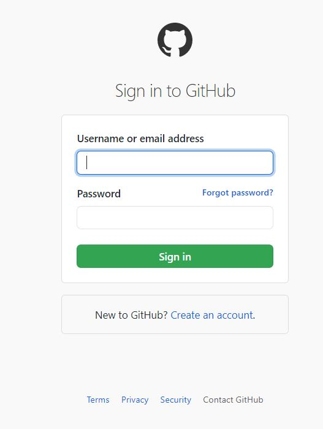
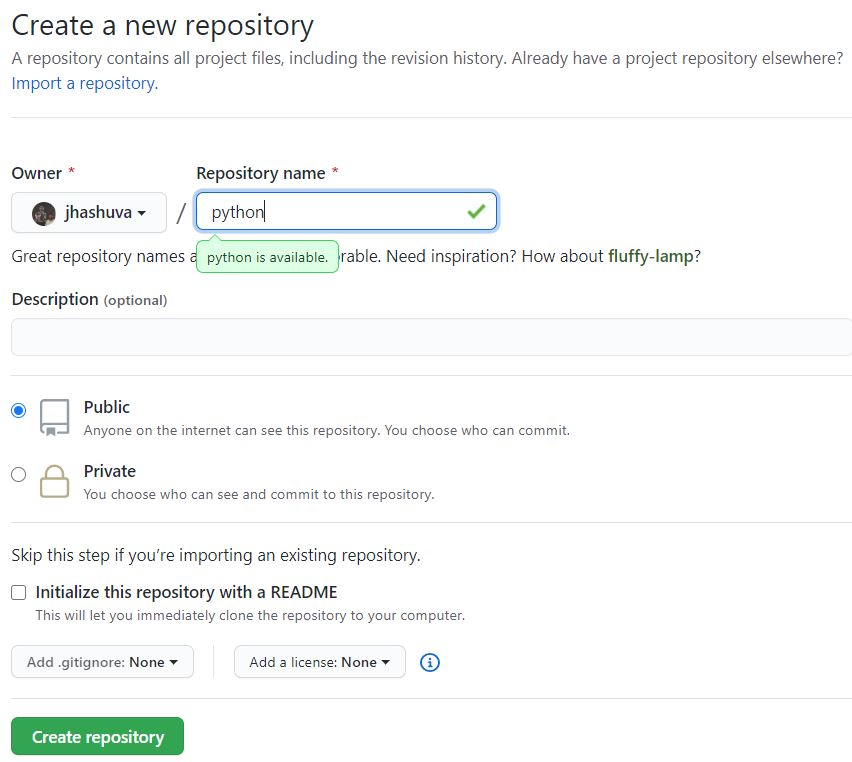

## What is Github ?

- GitHub provides hosting for software development.
- It also provides version control using Git.
- It offers distributed version control.
- It offers source code management(SCM) functionality of Git.
- It provides access control and several collaborations features such as bug tracking, feature requests, task management, and wikis for every project.

* It offers basic services free of cost.

### Create GitHub account

1. Goto the GitHub website (https://github.com/)

2. Sign up for GitHub

3. Sign in to your github account.

4. Create a new repository

Now you are done. We will see later how to save our program files in this repository.

[Go back](./index.md)
