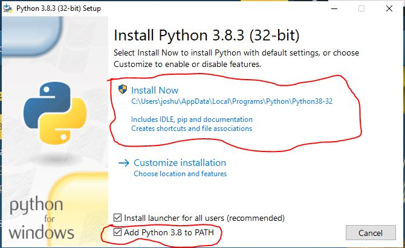

## Install in windows

1. Goto the website https://www.python.org/downloads/

2. Download the latest version of python(3.8)

3. Install the python.

4. After completion of the install verify the status by opening the command prompt and type python

If you see the status like above mentioned image, yeah! You succesfully installed python.
